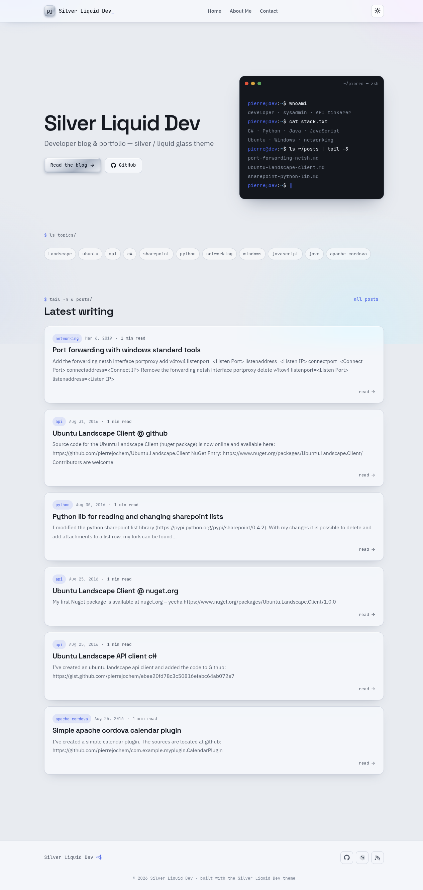
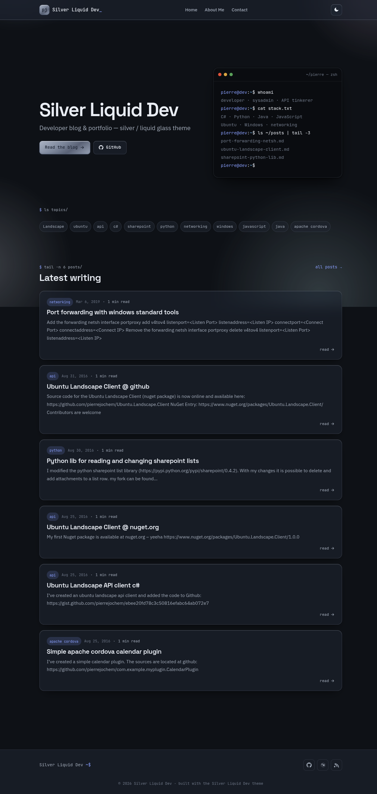

# Silver Liquid Dev

A modern WordPress theme for a developer's blog and portfolio — a brushed-silver,
**liquid-glass** aesthetic with frosted translucent surfaces, iridescent accents, a
terminal-inspired hero, editor-style code blocks with copy buttons, and full light/dark mode.

This repository contains the theme source (`src/`) plus a Dockerized local WordPress dev
environment driven by a `Makefile`.

| Light | Dark |
|-------|------|
|  |  |

## Features

- Brushed-silver / liquid-glass surfaces (`backdrop-filter`) with a reduced-transparency fallback
- Light & dark mode — follows the OS, header toggle, choice remembered (no flash on load)
- Terminal-style front-page hero, topics row, and latest-posts list
- Sticky sidebar on blog / archive / search listings
- Dark code blocks with one-click copy buttons
- Custom logo, custom background, primary + footer menus
- Responsive, keyboard-accessible, respects `prefers-reduced-motion`
- Passes the WordPress.org [Theme Review required checklist](https://make.wordpress.org/themes/handbook/review/required/)

## Requirements

- [Docker](https://docs.docker.com/get-docker/) with the Compose plugin
- `make`, `rsync`, `zip` (standard on most Linux/macOS setups)

## Quick start

```bash
make up        # start WordPress + MariaDB (http://localhost:8080)
make setup     # install WordPress + activate the theme (first boot only)
make import    # optional: load the pseudonymized example content + media
```

Then open **http://localhost:8080** — admin at `/wp-admin` (`admin` / `admin`).

Edits in `src/` are live-mounted into the container, so changes appear on reload — no rebuild.

## Make targets

| Target | Description |
|--------|-------------|
| `make up` | Start WordPress + DB (detached) |
| `make setup` | Install WordPress and activate the theme |
| `make import` | Import `data/*.xml` content + `data/*.tar` media (as attachments + featured images) |
| `make down` | Stop containers (keep data) |
| `make restart` | Restart containers |
| `make logs` | Tail WordPress logs |
| `make shell` | Shell into the WordPress container |
| `make wp CMD="…"` | Run a wp-cli command, e.g. `make wp CMD="plugin list"` |
| `make lint` / `make phpcbf` | Lint / auto-fix against WordPress coding standards |
| `make zip` | Build the distributable theme zip into `dist/` |
| `make clean` | Stop containers and **delete all data** + `dist/` |

Override the port with `WP_PORT`, e.g. `WP_PORT=9000 make up`.

## Packaging & installing

```bash
make zip
```

Produces `dist/silver-liquid-dev.zip`, wrapped in a top-level `silver-liquid-dev/` folder as
WordPress requires. Install it on any site via **Appearance → Themes → Add New → Upload Theme**.

## Continuous integration

GitHub Actions workflows live in `.github/workflows/`:

- **CI** (`ci.yml`) — runs on every push / PR to `main`:
  - PHP syntax lint across PHP 7.4 → 8.3
  - WordPress Coding Standards (PHPCS + WPCS, config in `phpcs.xml.dist`) — fails on errors, warnings are advisory
  - Builds the theme zip and verifies it's wrapped in a single `silver-liquid-dev/` folder (uploaded as an artifact)
- **Release** (`release.yml`) — runs on a `v*` tag: verifies the tag matches the `Version:` header in `style.css`, builds the zip, and publishes a GitHub Release with the zip attached and the matching changelog section as notes.

**Dependabot** (`.github/dependabot.yml`) opens weekly grouped PRs for GitHub Actions and the Docker image tags in `docker-compose.yml`.

Cut a release:

```bash
git tag v1.1.0 && git push origin v1.1.0
```

## Project structure

```
.
├── src/                     # the theme (live-mounted in dev)
│   ├── style.css            # theme header + full design system (silver / liquid glass)
│   ├── functions.php        # setup, enqueue, menus, widgets, helpers
│   ├── *.php                # templates (header, footer, front-page, single, archive, …)
│   ├── template-parts/      # content cards + single body + empty state
│   ├── assets/js/theme.js   # dark mode, mobile nav, copy buttons
│   ├── readme.txt           # WordPress.org theme readme
│   └── screenshot.png       # theme screenshot (1200×900)
├── data/                    # example content for `make import`
│   ├── example-content.xml  # pseudonymized WXR export
│   └── media-export.tar     # media library archive
├── dist/                    # built theme zip (generated)
├── .github/workflows/       # CI (lint + WPCS + package) and Release pipelines
├── phpcs.xml.dist           # WordPress Coding Standards config
├── docker-compose.yml       # WordPress + MariaDB + wp-cli
└── Makefile                 # dev environment driver
```

## Example content

`data/example-content.xml` is a **pseudonymized** WordPress export — all author identity,
emails, and site/profile URLs have been replaced with `example.com` / `Example Author`
placeholders. It's safe to share and exists only to populate the dev site for previewing the
theme.

## License

[GPL-2.0-or-later](https://www.gnu.org/licenses/gpl-2.0.html), the same as WordPress.
Fonts (Space Grotesk, IBM Plex Sans, JetBrains Mono) are served from Google Fonts under the
SIL Open Font License 1.1 — see `src/readme.txt` for full resource credits.
